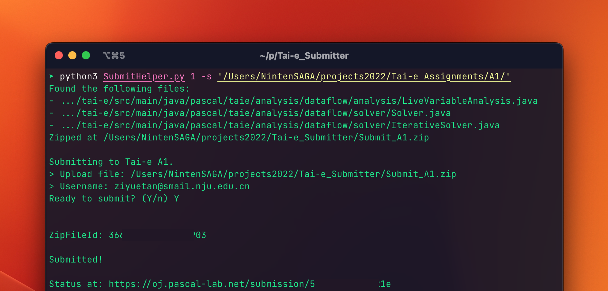

# Tai-e Submitter

A CLI tool used to submit assignment for *NJU Software Analysis Tai-e* OJ.

## Setup

### Dependency

```toml
python = "3.10"
requests = "^2.28.1"
```

### Run

You can either install the dependencies manually, or run it with ***poetry***:

```bash
.../Tai-e_Submitter> poetry install
.../Tai-e_Submitter> poetry run python ./SubmitHelper.py
```

## Usage

```
usage: SubmitHelper.py [-h] [--src SRC] [--file FILE] aid

positional arguments:
  aid                   Assignment ID (from 1 to 8)

options:
  -h, --help            show this help message and exit
  --src SRC, -s SRC     src directory of the assignment, for auto zipping
  --file FILE, -f FILE  Submit file path (end with .zip)
```

You must run it in one of the following manners:

1. `SubmitHelper.py [1-8] -f SampleFile.zip`
   - Upload an existed zip file
2. `SubmitHelper.py [1-8] -s path/to/my/src_dir`
   - Tell the src directory, and let the program do the zipping for you

**The username and password should be assigned to environment variable `TAI_E_USERNAME` and `TAI_E_PASSWORD` seperately.**

----

Full example:

```bash
TAI_E_USERNAME=jyywiki \
TAI_E_PASSWORD=114514 \
poetry run python ./SubmitHelper.py 1 -f 1515819.zip
```

### Target files

`submit_files.json` constains a list of target files according to lab manuals (last updated at Oct. 7, 2022). 

You can modify it if you like.
